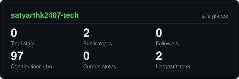
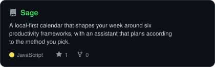

<!-- PORTRAIT -->

 

<!-- NAME / TAGLINE -->

  

<!-- SOCIAL LINKS -->

---

## 👨‍💻 `~/` whoami

B.Tech Cyber Security student passionate about programming, cybersecurity and technology.

I enjoy building projects, solving coding problems and exploring how technology can be used to make systems more secure.

Currently learning **Java** and building **CyberShield**, a cybersecurity-focused website.

---

## 🛠️ Tech Stack

### Programming Languages

### Web Development

### Areas of Interest

---

## 🛡️ CyberShield

**CyberShield** is my current project — a website focused on cybersecurity.

The project is part of my journey to combine **Web Development + Cyber Security + AI**.

🚧 **Currently in development**

---

## 🎯 Interests

* 💻 Coding
* 🛡️ Cyber Security
* 🤖 AI
* 🏏 Sports
* ✏️ Sketching
* 🎨 Crafting

---

## 📊 GitHub Metrics

### 🔥 Contribution Calendar

  

### 💡 Coding Habits

  

### 🧑‍💻 Most Used Languages

  

### 🕸️ Cyber Security Skill Radar

  

### 📈 Language Radar

  

### 🏆 Achievements

  

### 📈 GitHub Stats

  

---

## 🚀 Featured Projects

### Sage

  

### Socrates

  

### Dossier

  

### humanOS

  

---

## 🚀 Currently Learning

**Java** and expanding my knowledge of:

* Cyber Security
* Artificial Intelligence
* Web Development
* Data Structures & Algorithms

---

## 🌱 Goals

* Build useful cybersecurity projects
* Complete and improve CyberShield
* Become stronger in Java
* Improve problem-solving skills
* Explore AI + Cyber Security
* Keep learning and building

---

### Thanks for visiting my profile!

